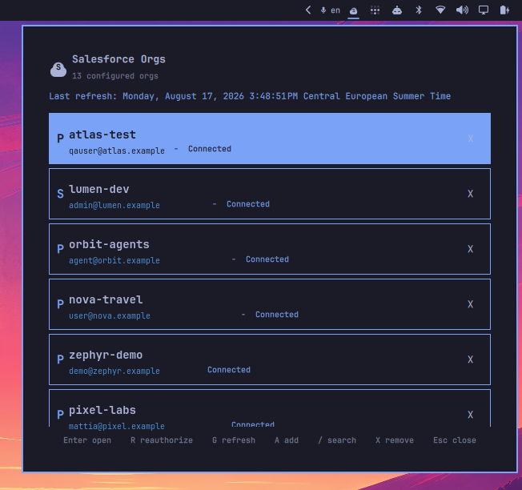

# Salesforce Orgs — Omarchy Quattro Plugin

An Omarchy Quattro plugin that manages Salesforce CLI org connections from the bar: browse connected orgs, open them in a browser, reauthenticate, and add new orgs — all keyboard-driven from a bar popup.

Built for Salesforce developers who work across multiple orgs, the plugin reduces context switching by putting org access and authentication management a few keystrokes away. Quickly open the right org, reauthenticate a connection, refresh the org list, or add a new environment without leaving your desktop workflow.

The repository root is the plugin folder (`manifest.json` sits beside the entry points), so it validates with `omarchy plugin validate` exactly as published.



## Features

- Lists all orgs returned by `sf org list --json`
- Sorts connected orgs first, then by name
- Shows alias, username, connection status, environment (production/sandbox), and the default-org marker
- Opens the selected org in a browser
- Reauthenticates the selected org with a live `sf org login web` process
- Adds production, sandbox, or custom-URL orgs
- Logs an org out of the local CLI after confirmation
- Loads the last cached snapshot instantly; refresh manually with `G` or middle-click
- Full keyboard and mouse navigation
- Opens from the bar icon; an optional `SUPER CTRL ALT S` binding is documented below

## Keyboard shortcuts

Inside the panel:

| Key | Action |
| --- | --- |
| `↑` / `↓` or `j` / `k` | Move through orgs |
| `Enter` or `o` | Open the selected org |
| `r` | Start browser login for the selected org |
| `g` | Refresh all orgs and update the cache |
| `a` | Add an org (choose environment, then enter an alias) |
| `/` | Search by org name, alias, or username |
| `x` | Log the selected org out (confirm with `y`, cancel with `n` or `Esc`) |
| `Esc` | Close the popup |

On the bar icon: middle-click refreshes.

## Requirements

- Omarchy Quattro
- Salesforce CLI (`sf`) on `PATH`
- A Salesforce CLI installation with permission to launch browser authentication

The plugin executes Salesforce CLI commands directly and does not store credentials itself.

## Installation

The standard Omarchy installation process clones the public repository, validates its root manifest, and can enable the plugin in one command:

```bash
omarchy plugin add https://github.com/Kristijan-K/salesforce-omarchy-plugin.git --enable
```

Review the repository confirmation prompt and choose the bar placement when Omarchy asks. `omarchy plugin install` is an alias for the same command.

## Optional keybinding

The Omarchy installer does not modify Hyprland keybindings. To open the panel with `SUPER CTRL ALT S`, add this line to `~/.config/hypr/bindings.lua`:

```lua
o.bind("SUPER + CTRL + ALT + S", "Salesforce orgs", "omarchy-shell shell summon io.github.kristijan-k.salesforce-orgs '{}'")
```

Reload Hyprland after saving the file. The bar icon remains available without this optional binding.

For a manual installation from a checkout of this repository:

```bash
PLUGIN_ID="io.github.kristijan-k.salesforce-orgs"
mkdir -p "$HOME/.config/omarchy/plugins/$PLUGIN_ID"
cp manifest.json BarWidget.qml Service.qml Model.js SalesforceIcon.qml auth-web-login.sh README.md LICENSE \
  "$HOME/.config/omarchy/plugins/$PLUGIN_ID/"
omarchy plugin validate "$HOME/.config/omarchy/plugins/$PLUGIN_ID"
omarchy-shell shell rescanPlugins
omarchy plugin enable "$PLUGIN_ID"
omarchy bar put "$PLUGIN_ID" --section right
```

Or use the dev installer (validates, copies, rescans, enables, and places the widget):

```bash
./install-local.sh
```

## Removal

```bash
PLUGIN_ID="io.github.kristijan-k.salesforce-orgs"
omarchy plugin disable "$PLUGIN_ID"
omarchy plugin remove "$PLUGIN_ID"
```

Removing the plugin leaves the Salesforce CLI configuration untouched. To also drop the plugin's cache and login-state files:

```bash
rm -f "$HOME/.cache/omarchy/salesforce-orgs.json"
rm -rf "${XDG_RUNTIME_DIR:-$HOME/.cache/omarchy}/omarchy-sf-plugin"
```

## How it works

The plugin provides two shell entry points:

- `Service.qml` — a headless `service` that owns all `sf` CLI interaction. It refreshes `sf org list --json`, parses the output (`Model.js`), caches the snapshot in `~/.cache/omarchy/salesforce-orgs.json`, and runs open/logout actions with a 120 s timeout and generation-counted state reconciliation.
- `BarWidget.qml` — the `bar-widget` entry point: a Salesforce cloud icon on the bar and the keyboard popup. It is pure UI; every action delegates to the service.

Browser authentication (`sf org login web`) runs detached via `auth-web-login.sh` in `$XDG_RUNTIME_DIR/omarchy-sf-plugin/` so closing the popup or the shell cannot kill the OAuth listener. The service polls the login status file until the browser flow completes, then refreshes the org list.

## Development

```bash
./run-tests.sh       # QML state-machine tests (offscreen qmltestrunner)
omarchy plugin validate .
./install-local.sh   # developer shortcut for testing the current checkout
```

`install-local.sh` is not required for normal users. It copies the current working tree into Omarchy without requiring a GitHub push, which is useful while developing changes locally. The closest test of the default installer is:

```bash
omarchy plugin add "$PWD" --enable --yes
```

The local-add command clones the committed state of the checkout, so commit changes first when using it. Remove that test installation with:

```bash
omarchy plugin remove "io.github.kristijan-k.salesforce-orgs" --yes
```

Edit files at the repository root, run the tests, validate the manifest, and test from the bar icon or the optional keybinding above.

## License

[MIT](LICENSE). This plugin depends on Omarchy Quattro and the Salesforce CLI; neither is bundled or modified.
